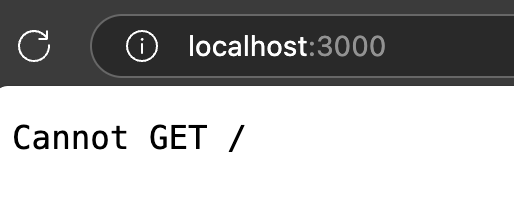
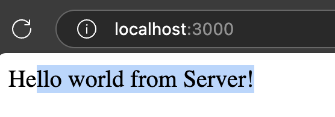

# Lecture 010:

1. Create a folder
2. Open the folder in VS Code
3. Run the command:
```bash
npm init -y
```

# Lecture 011:
1. Open folder in VS Code
2. Install `express` running the command:
```bash
npm i express
```

> For dev-dependencies:
```bash
npm i -D <library>
```
or
```bash
npm i --save-dev <library>
```
3. Delete `node_modules` folder
4. Run command in order to have `node_moudles` folder again:
```bash
npm i
```

# Lecture 012: Ejecutando Código de Node desde el package.json

1. Create `index.js` file. 
(it could be `app.js` or `main.js` or `node.js`...)

2. Inside this file, add:
```js
console.log("Hello World desde NodeJs");
```

3. Modify the `"scrript"` section in `package.json` file:
```js
"script" {
    "start": "node ./index.js"
}
```

4. Run from terminal:
```bash
npm run start
```

5. In order to avoid running everytime the `npm run start`, install `nodemon`:
```bash
npm i -D nodemon
```

## How using `nodemon`:
1. Open `package.json` file then add:
```js
"script" {
    "start": "node ./index.js",
    "server": "nodemon ./index.js"    //👈🏽
}
```

2. Run from terminal:
```bash
npm run server
```

# Lecture 013: creating a `server` with `express`:

1. Open `index.js` file then add:
```js
const express = require('express');

//create app:
const app = express()

//define a port then run project:
const port = 3000; 

app.listen(port, () => {
    console.log(`Server is running in port ${port}`);
});
```

2. Open a browser then go to `http://localhost:3000/`
In this terminal you will see "Server is running in port 3000".

3. In broswe you will see:

> Need to define routing and content page.

4. Add the routing code:
```js
// routing with a callback function
app.get('/', (req, res) => {
    res.send("Hello world from Server!");
})
```
> `req`: Request & `res`: Response

5. Go to opened browser:


5. What is this `app.get(...)`
`app.get(...)` is an instance of our express application.

> What happen when switch from `get` to `post`❓

6. Add the following code:
```js
app.get('/about-us', (req, res) => {
    res.send("About us!");
})
```
> Go to browser and search for URL: http://localhost:3000/about-us

> What  happen when you search for an non-existent URL.

7. you can `send` info, `json` response or `render`:
```js
app.get('/about-us', (req, res) => {
    res.send("About us!");
})

app.get('/about-us', (req, res) => {
    res.json({ msg: "Hello from Express"});
})

app.get('/about-us', (req, res) => {
    res.render("...");
})
```

# Lecture 014: Enable JS Modules:

1. Common JS:
```js
const express = require('express');
```

2. Enable ECMAScript Modules (ESmodules)
- Open `Package.json` file and then add:
```js
{
    "type": "module",
    "script" {...}
}
```
> Do not forget to see the errors from terminal.

3. Open `index.js` file and modify:
```js
import express from 'express';
// const express = require('express');
```

